# Goal Getters: The Ultimate Soccer Quiz Challenge.

Visit the deployed site here: [Goal Getters](https://deepeshpatel11.github.io/Goal-Getters/index.html)

Test your footballing knowledge with this quiz and post your high scores on your social media apps!

Football quizzes are a fun and engaging way for fans to test their knowledge of the game, from player stats and historic matches to club trivia. They challenge enthusiasts to recall facts and details, making the love for football even more interactive and exciting.

---

## CONTENTS

* [User Experience](#user-experience)
* [Design](#design)
* [Technologies Used](#technologies-used)
* [Deployment & Local Development](#deployment--local-development)
* [Testing](#testing)
* [Credits](#credits)

---

## User Experience

### User Stories

#### First Time Visitor Goals

* As a first-time visitor, I want to participate in a football quiz that challenges my knowledge of the game and enhances my understanding of football.
* I want the site to be responsive and function smoothly on my device, whether I’m using a smartphone, tablet, or desktop.
* I want the site to be intuitive and easy to navigate, allowing me to start a quiz quickly without any confusion.

#### Returning Visitor Goals

* As a returning visitor, I want to be able to select a quiz category that aligns with my interests or knowledge area, such as English Football, Spanish Football, Italian Football, or Continental Football.
* I want to track my previous scores and attempt to improve my performance in subsequent visits, motivating me to keep playing.
* I want to explore new categories or themes to test different aspects of my football knowledge, keeping the quizzes fresh and challenging.

#### Frequent Visitor Goals

* As a frequent visitor, I want to be able to adjust the quiz settings or themes to keep the challenges engaging and aligned with my growing knowledge.
* I want to save and review my high scores across different categories, allowing me to track my progress and strive for continuous improvement.
* I want the site to offer occasional updates or new content, such as new quiz categories or questions, to maintain my interest and encourage repeated visits.

---

## Design

### Design Choices and Colour Scheme Rationale

In designing the football quiz website, I focused on creating a visually engaging yet balanced experience that reflects the energy of football while ensuring the content is easy to read and interact with. The colour scheme was carefully selected to complement the football theme and maintain clarity across various devices.

#### Colour Palette

* **Primary and Secondary Text Colours:**
    * I chose `#f0f0f0` (a light gray) for the primary text colour and `#333333` (dark gray) as the secondary text colour. These colours provide strong contrast against the darker background, enhancing readability and ensuring the text remains accessible on all devices.

* **Background and Overlay:**
    * The website features a football-themed background image that creates an immersive experience. To ensure that text and other elements stand out clearly against this background, I used `rgba(0, 0, 0, 0.7)` (a semi-transparent black) as an overlay. This overlay subtly darkens the background, allowing the content to be the focal point without diminishing the visual appeal of the background image.

* **Interactive Elements:**
    * For interactive elements such as buttons and links, `#1e90ff` (Dodger blue) was used. This vibrant colour is consistent with the theme and draws attention to clickable areas, guiding users through the site.

* **Theme-Specific Colours:**
    * Each quiz category has its distinct colour scheme, enhancing the thematic connection and user experience:
        * English Football: Red `#ec0404` reflects the iconic colours associated with English football.
        * Spanish Football: Yellow `#ffc400` and Red `#c60b1e` evoke the colours of the Spanish flag.
        * Italian Football: Green `#008C45` and Red `#CD212A`, corresponding to the Italian flag.
        * Continental Football: Blue `#003399` and Yellow `#ffcc00` represent the broader European football theme.

* **Feedback for Answers:**
    * To provide clear feedback during the quiz, I used `#ff6347` (Tomato red) for incorrect answers and `#1e90ff` (Dodger blue) for correct answers. These colours are chosen for their visibility and ease of differentiation, helping users immediately understand their performance.

#### Consistency in Design

While I didn’t use CSS variables in this project, I maintained consistency in design by carefully selecting and applying these colours throughout the CSS file. Each colour was chosen for its specific role in enhancing user experience, whether through improving readability, guiding user interactions, or thematically tying the content to the world of football.

The design choices aimed to balance visual impact with user-friendliness, ensuring that the website is not only aesthetically pleasing but also functional and easy to navigate for all users.

### Typography

Google Fonts was utilized to import the chosen fonts, ensuring that the text throughout the site is both visually appealing and easy to read. The typography was selected to align with the energetic and dynamic nature of football while also maintaining clarity and accessibility across various devices.

#### Page Title and Headings

For the page titles and headings, I have used the Google font [Orbitron](https://fonts.google.com/specimen/Orbitron?query=orbitron).
* Orbitron is a geometric sans-serif typeface that has a futuristic, sporty feel, making it an ideal choice for a football-themed quiz site. The strong, clean lines of this font convey a sense of energy and competition, which is perfect for engaging users right from the moment they land on the site.

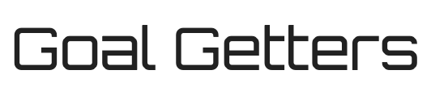

#### Body Text

For the body of the page, I opted for the Google font [Russo One](https://fonts.google.com/specimen/Russo+One?query=russo+one).
* Russo One is a sans-serif font that is bold and impactful, yet remains easy to read. This font has a modern and robust appearance, which complements the high-energy atmosphere of the quiz while ensuring that the content is legible and accessible. The choice of a sans-serif font for the body text was deliberate, as sans-serif fonts are generally recognized for their readability on screens, making it easier for users to engage with the quiz content without straining their eyes.

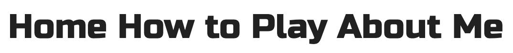

### Visual Example of Typography in Use

The combination of Orbitron for headings and Russo One for the body text creates a cohesive, sporty aesthetic that enhances the overall user experience. These fonts work together to make the website feel dynamic and engaging, while also maintaining the clarity and legibility that is essential for an interactive quiz platform.

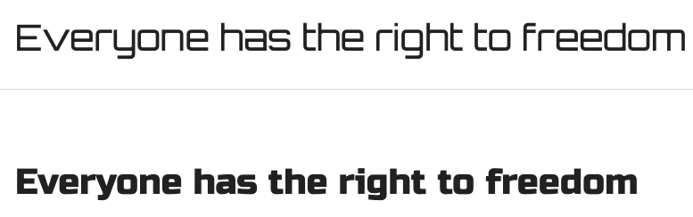

### Wireframes

Wireframes were created for mobile, tablet, and desktop using Balsamiq.

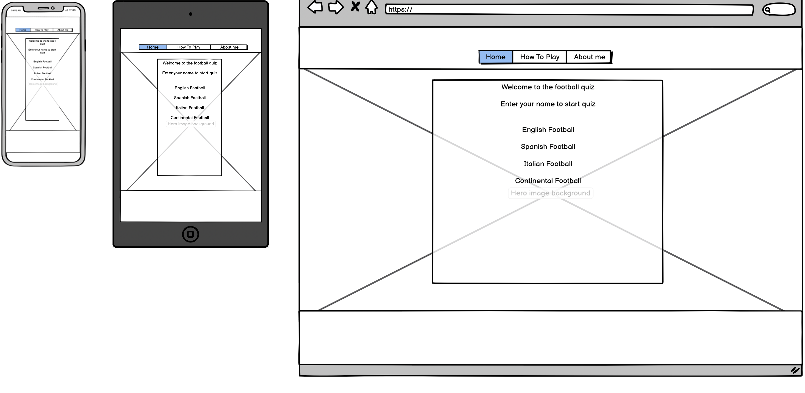
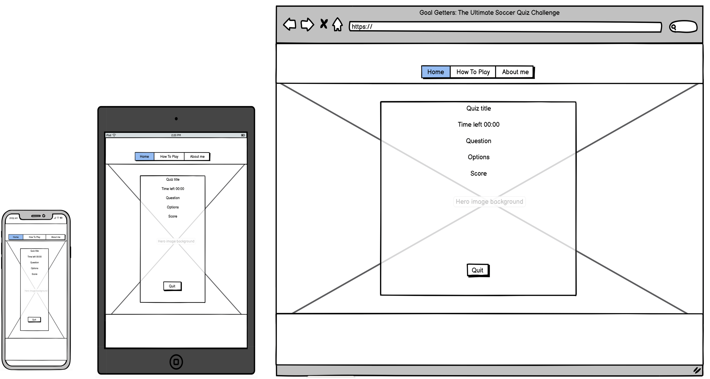

### Features

The Goal Getters website is comprised of an Index Page (Home Page), Quiz Page, How to Play page, About Me page, and a 404 error page.

All pages on the website are responsive and include:

* A favicon in the browser tab.

  

* A dynamic navigation menu that becomes a dropdown on mobile devices (the second and third screenshots displayed below), ensuring ease of use on all screen sizes.

  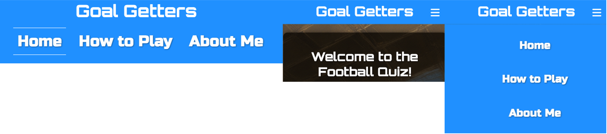

#### The Home Page

The home page of "Goal Getters: The Ultimate Soccer Quiz Challenge" welcomes users with a title and a brief introduction. Users are prompted to enter their name to start the quiz, with four different quiz categories available: English Football, Spanish Football, Italian Football, and Continental Football. Each category button is designed to lead users directly to the corresponding quiz.

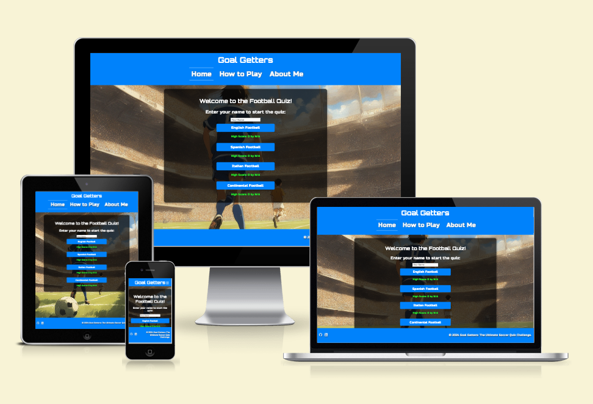

The home page also displays the highest scores achieved in each category, along with the name of the user who achieved it. This adds a competitive edge, encouraging users to beat the top scores.

#### The Quiz Page

The quiz page is where the main action takes place. Upon selecting a quiz category from the home page, users are taken to the quiz page, where the selected quiz begins. The page displays the question and several answer options.

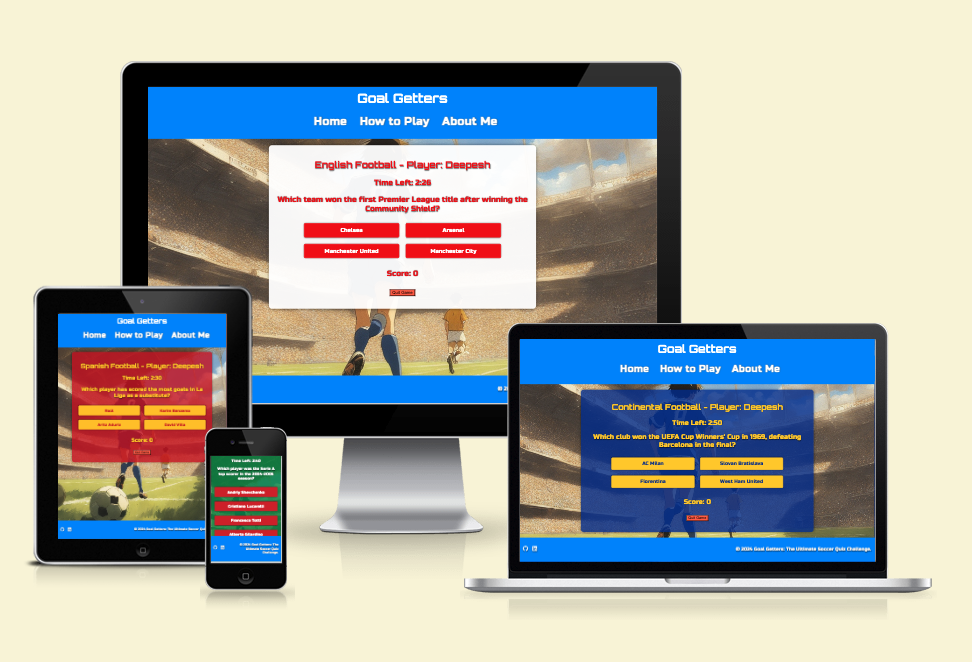

When a user selects an answer, the correct and incorrect answers are visually highlighted, providing immediate feedback. The score is updated in real-time, and users can proceed to the next question. After all questions have been answered, the final score and a summary of the user’s performance are displayed, including the correct answers for any missed questions.

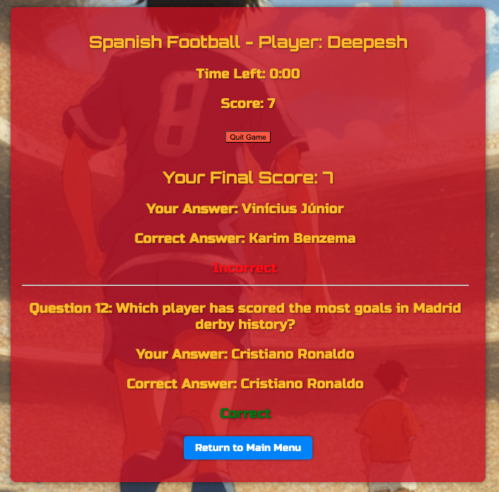

The quiz page also features a timer to keep the quiz competitive and engaging, along with a "Quit Game" button that allows users to exit the quiz at any time.

#### The About Me Page

The "About Me" page provides a personal touch to the website, giving users insight into the creator's passion for football and their favorite team, Inter Milan. It shares a brief bio that connects with football fans and highlights the personal motivation behind creating the quiz.

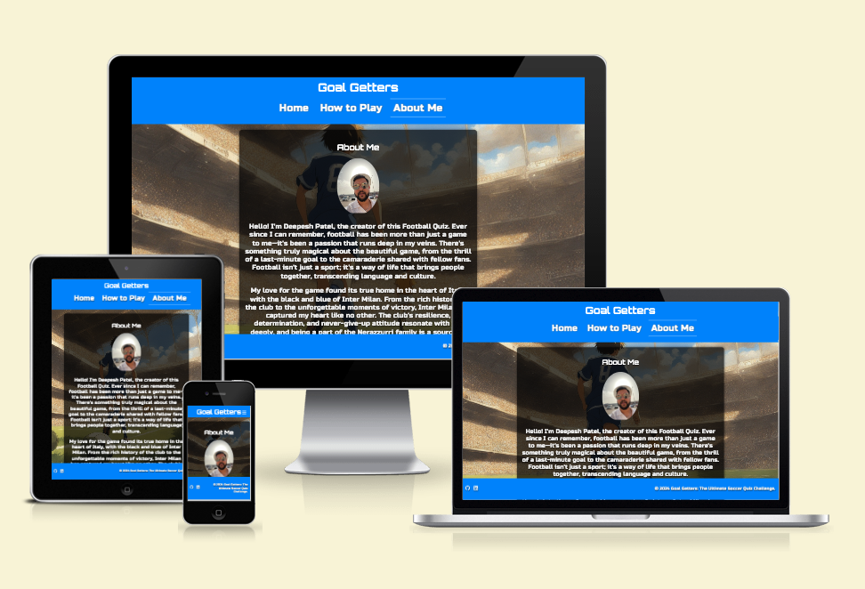

#### The 404 Error Page

The 404 error page is designed to handle any incorrect URLs entered by users. It displays a friendly error message and offers links back to the home page, ensuring that users can easily navigate back to the main content of the site.

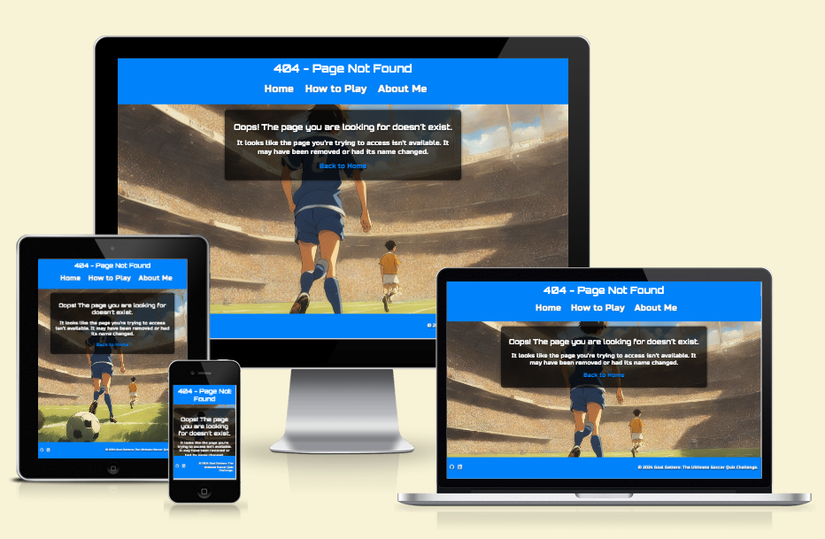

#### Future Implementations

In future updates, I would like to:

1. **Add more quiz categories** to cover a broader range of football knowledge, including international tournaments and historic football events.
2. **Introduce difficulty levels** so that users can choose quizzes that match their skill level, from beginner to expert.
3. **Implement a multiplayer mode** where users can compete in real-time against others, enhancing the competitive aspect of the quiz.
4. **Develop a leaderboard feature** that allows users to see where they stand compared to others worldwide.
5. **Enhance accessibility** by considering options for colour-blind users, such as adding symbols to correct and incorrect answers.

### Accessibility

I have been mindful during the development process to ensure that the website is accessible to all users. This was achieved by:

* Using **semantic HTML** to structure the content clearly.
* Implementing a **hover state on all buttons** to provide visual feedback when interacting with the site.
* Choosing a **sans-serif font** for the body text, which is generally easier to read on screens and accessible to users with dyslexia.
* Ensuring **sufficient colour contrast** throughout the site, particularly in the quiz feedback to clearly distinguish between correct and incorrect answers.

As the site relies on colour to indicate correct and incorrect answers, future updates may include additional accessibility features, such as symbols or alternative text options, to better serve users with colour vision deficiencies.

---

## Technologies Used

### Languages Used

* HTML
* CSS
* JavaScript

### Frameworks, Libraries & Programs Used

* [Balsamiq](https://balsamiq.com/) - Used to create wireframes.
* [Git](https://git-scm.com/) - For version control.
* [GitHub](https://github.com/) - To save and store the files for the website.
* [GitPod](https://gitpod.io/) - IDE used to create the site.
* [Google Fonts](https://fonts.google.com/) - To import the fonts used on the website.
* [Am I Responsive?](http://ami.responsivedesign.is/) To show the website image on a range of devices.
* [Google Developer Tools](https://developers.google.com/web/tools) - To troubleshoot and test features, solve issues with responsiveness and styling.
* [Favicon.io](https://favicon.io/) To create a favicon.
* [Deepai.org](https://deepai.org/) To generate an AI image for the background.
* [AwesomeFont](https://fontawesome.com/) To generate visual icon links for social media links and drop-down menus.
* [SweetAlert2](https://sweetalert2.github.io/) - Used to replace the default browser alert messages with custom-styled webpage alerts for consistency.

---

## Deployment & Local Development

### Deployment

The site is deployed using GitHub Pages at [Goal Getters: The Ultimate Soccer Quiz Challenge](https://github.com/Deepeshpatel11/Goal-Getters).

To deploy the site using GitHub Pages:

1. **Login (or signup) to GitHub.**
2. **Go to the repository for this project, [Deepeshpatel11/Goal-Getters](https://github.com/Deepeshpatel11/Goal-Getters).**
3. **Click the `Settings` button.**
4. **Select `Pages` in the left-hand navigation menu.**
5. **From the `Source` dropdown, select `main` branch and press `Save`.**
6. **The site is now deployed. Please note that this process may take a few minutes before the site goes live.**

### Local Development

#### How to Fork

To fork the repository:

1. **Log in (or sign up) to GitHub.**
2. **Go to the repository for this project, [Deepeshpatel11/Goal-Getters](https://github.com/Deepeshpatel11/Goal-Getters).**
3. **Click the `Fork` button in the top right corner.**

#### How to Clone

To clone the repository:

1. **Log in (or sign up) to GitHub.**
2. **Go to the repository for this project, [Deepeshpatel11/Goal-Getters](https://github.com/Deepeshpatel11/Goal-Getters).**
3. **Click on the `Code` button, select whether you would like to clone with `HTTPS`, `SSH`, or `GitHub CLI`, and copy the link shown.**
4. **Open the terminal in your code editor and change the current working directory to the location where you want to use for the cloned directory.**
5. **Type `git clone` into the terminal and then paste the link you copied in step 3. Press `Enter`.**

---

## Testing

Please refer to [TESTING.md](TESTING.md) file for all testing carried out.

### Fixed Bugs

| No | Bug | How I solved the issue |
| :--- | :--- | :--- |
| 1 | An error was occurring when loading the quiz, the respective themes were not loading. | JS was missing code to apply the theme based on category. Resolved when running code through the console and [JavaScript-Tutor](https://pythontutor.com/visualize.html#mode=edit). |
| 2 | Found a bug while testing the quiz, where option 1 was usually the correct answer for the question being asked. | Resolved this bug by adding a shuffle function, which would shuffle the questions and the options for each category of quiz. This would also splice the question from the array so it would not be asked again. |
| 3 | Not necessarily a bug, but on user feedback, the quiz time was found to be too long at 15 minutes. | The quiz time was reduced from 15 minutes to 3 minutes. |
| 4 | From user feedback, found there were multiple repeat questions. | I reviewed the JSON file containing the questions and found duplicate questions. This was resolved by removing the duplicate questions from the array for each category and replacing them with unique questions in the JSON file. |
| 5 | JS code was present in the Index HTML file. | I removed the JS code and created a separate JS file (index.js) to load when the index file loaded. |
| 6 | The header was not responsive to mobile phone screen sizes. | I added a drop-down burger icon which would create a drop-down menu for mobile screen sizes. |
| 7 | The implemented summary page on quiz ending was overflowing out of the container. | Using CSS, I added an overflow property to the element to fix this bug. |
| 8 | The name input would allow blank space to start the quiz on index.html. | I corrected this using validation to the username to disallow spaces. I also added JS code to ensure real-time validation and allow valid characters. |
| 9 | On JSHint check of JS code on both index.js and script.js, it flagged the use of unused variables | On review with mentor, I was advised to change these functions to event listeners. I updated the code to make these changes. |

### Known Bugs

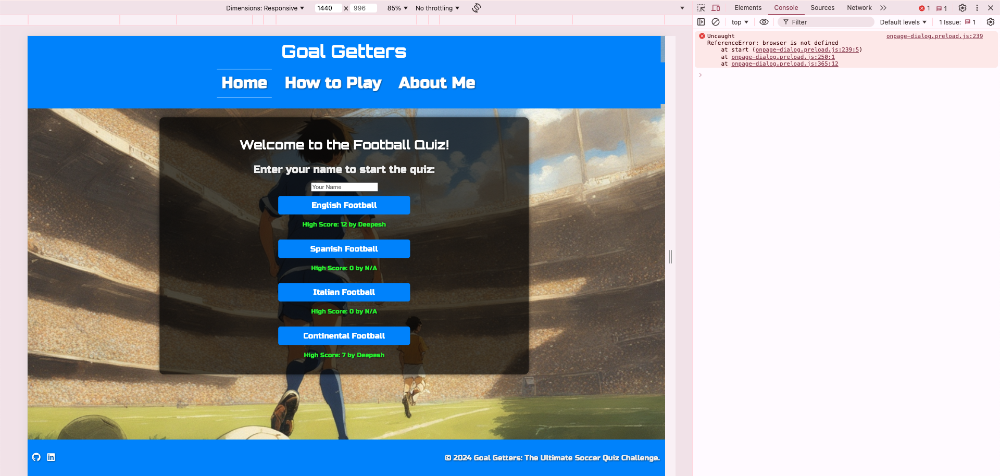

* A warning appears in the console on the live page due to GitHub Pages disabling Google’s third-party cookie alternative, FLoC, which triggers this error. However, this warning does not impact the functionality of the site.

---

## Credits

### Code Used

* I took inspiration to build the functionality of the quiz with this [YouTube Tutorial](https://www.youtube.com/watch?v=PBcqGxrr9g8) by GreatStack. This helped me list all the functions necessary to build the quiz.
* I used this [YouTube Tutorial](https://www.youtube.com/watch?v=Oage6H4GX2o) by ByteGrad. This built my understanding to fetch questions from my JSON file to allow the content to be loaded into the quiz page.
* The Code Institute JS syllabus did not cover local storage; I relied on [YouTube Tutorials](https://www.youtube.com/watch?v=DFhmNLKwwGw) by James Q Quick and guidance from my mentor to write the code that allowed storing the high scores for the respective user. I also relied on the Slack community when I was struggling to achieve this functionality.
* I also used the Hackathon I was involved with ([StarWars Hackathon](https://star-wars-e347f35c852d.herokuapp.com/)) as a guide to build my website, which was also a quiz-based website.
* I used Microsoft Co-pilot to debug my code in JavaScript when the functions would not work correctly.
* I also applied the knowledge I gained from completing a JavaScript course on Percipio through [Learning People](https://learningpeople.percipio.com/track/1a5a5852-b8b7-45ab-8d49-008b6f2c167d).

### Content

* The questions used in the quiz were generated using [ChatGPT](https://chatgpt.com/).

### Media

* The background image on display for the quiz was generated using [Deepai.org](https://deepai.org/).
* An image of myself has also been used on the About Me page.

### Acknowledgments

I would like to acknowledge the following people:

* My Code Institute Mentor, Jubil Akolade, provided invaluable guidance whenever I faced challenges, inspiring me to create the best possible version of this website. His insights and ideas were instrumental in making "Goal Getters" the best it could be.
* Tomáš Kubánčik for assisting me in debugging my code when I was struggling to identify the error.
* My friends and family for repeatedly testing the deployed website before I finalized it.
