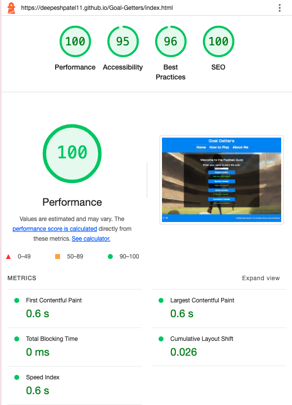
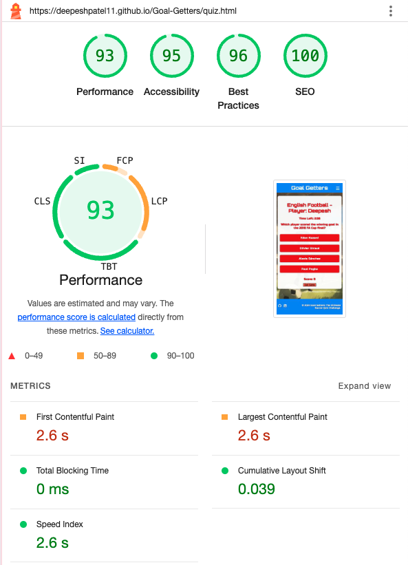
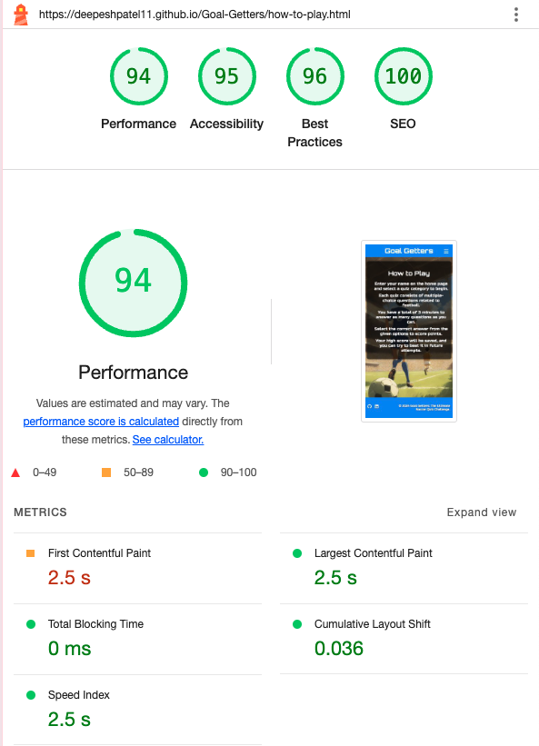

# Goal Getters: The Ultimate Soccer Quiz Challenge - Testing

Visit the deployed site here: [Goal Getters](https://deepeshpatel11.github.io/Goal-Getters/index.html)

---

## Contents

* [AUTOMATED TESTING](#automated-testing)
  * [W3C Validator](#w3c-validator)
  * [JavaScript Validator](#javascript-validator)
  * [Lighthouse](#lighthouse)
* [MANUAL TESTING](#manual-testing)
  * [Testing User Stories](#testing-user-stories)
  * [Full Testing](#full-testing)

---

## AUTOMATED TESTING

### W3C Validator

The HTML and CSS for all pages of the website were validated using the [W3C Validator](https://validator.w3.org/).

* `Index.html` --> Passed

* `Quiz.html` --> Passed

* `How-to-play.html` --> Passed

* `About-me.html` --> Passed

* `404.html` --> Passed

* `Style.css` --> Passed

---

### JavaScript Validator

JavaScript code was validated using [JSHint](https://jshint.com/).

* `Script.js` --> Passed
  
  

  * Although there is one unused variable shown on JSHint (Swal), this is due to it being called for from a library.

* `Index.js` --> Passed

  

  * Although there is one unused variable shown on JSHint (Swal), this is due to it being called for from a library.
---

### Lighthouse

#### Desktop Results

Home page result:

Quiz page result:

How to play page result:

About me page result:

404 error page result:

#### Mobile Results

Home page result:

Quiz page result:

How to play page result:

About me page result:

404 error page result:

---

## Manual Testing

### Testing User Stories

#### First Time Visitor Goals

| Goals | How are they achieved? |
| :--- | :--- |
| As a first-time visitor, I want to participate in a football quiz that challenges my knowledge of the game and enhances my understanding of football. | The Goal Getters site offers a variety of football-themed quiz categories, challenging users' knowledge across different areas of the sport. The quizzes are designed to be engaging and informative, helping users deepen their understanding of football. |
| I want the site to be responsive and function smoothly on my device, whether I’m using a smartphone, tablet, or desktop. | The site is built with responsive design principles, ensuring that it functions smoothly across all devices, including smartphones, tablets, and desktops. |
| I want the site to be intuitive and easy to navigate, allowing me to start a quiz quickly without any confusion. | The site features a simple and intuitive layout, with clear buttons for starting the quiz, selecting categories, and navigating between pages. Users can quickly begin a quiz without confusion. |

#### Returning Visitor Goals

| Goals | How are they achieved? |
| :--- | :--- |
| As a returning visitor, I want to be able to select a quiz category that aligns with my interests or knowledge area, such as English Football, Spanish Football, Italian Football, or Continental Football. | Users can select from multiple quiz categories, each focused on a different aspect of football. This allows returning visitors to choose a category that matches their interests or knowledge. |
| I want to track my previous scores and attempt to improve my performance in subsequent visits, motivating me to keep playing. | The site tracks and displays high scores for each quiz category, allowing users to see their best scores and strive to improve them on future visits. |
| I want to explore new categories or themes to test different aspects of my football knowledge, keeping the quizzes fresh and challenging. | The site provides a variety of quiz categories, and there is potential for new categories to be added in the future, ensuring that the content remains fresh and challenging for returning visitors. |

#### Frequent Visitor Goals

| Goals | How are they achieved? |
| :--- | :--- |
| As a frequent visitor, I want to be able to adjust the quiz settings or themes to keep the challenges engaging and aligned with my growing knowledge. | Frequent visitors can adjust their quiz experience by selecting different categories or themes, keeping the quizzes engaging and aligned with their evolving knowledge. |
| I want to save and review my high scores across different categories, allowing me to track my progress and strive for continuous improvement. | The site saves high scores for each category, allowing frequent visitors to track their progress over time and strive for continuous improvement. |
| I want the site to offer occasional updates or new content, such as new quiz categories or questions, to maintain my interest and encourage repeated visits. | The site is designed with the potential for future updates, including new quiz categories and questions, to keep the content fresh and encourage repeated visits from frequent users. |

---

### Full Testing

The deployed website has been tested on the following devices:

* Laptop
  * Macbook Pro 2023 16" screen
  * Lenovo Thinkpad X1 14" screen
* Tablet
  * Samsung Galaxy Tab S7 12.4"
  * Ipad Pro 2024 13"
* Mobile Devices:
  * IPhone 11
  * Samsung Galaxy S9+

The website has been tested on the following browsers on each devices:

* Google Chrome (On all devices)
* Safari (On Apple devices)
* Samsung Internet (On Samsung devices)
* Firefox (On all devices)

During the testing phase, I also had the website reviewed by friends and family. No issues were reported.

#### Home Page

| Feature | Expected Outcome | Testing Performed | Result | Pass/Fail |
| --- | --- | --- | --- | --- |
| The site navigation links are underlined to indicate the current page. | The home navigation link is underlined. | Load home page. | The home page is correctly identified by the underline on the home link. | Pass |
| Enter Name Input Validation | Name input field should not accept empty or invalid (with spaces) names | Entered invalid inputs (e.g., spaces) | Validation prevents quiz from starting | Pass |
| English Football Button | Starts the English Football quiz | Clicked on button | Quiz page opens with English Football theme| Pass |
| Spanish Football Button | Starts the Spanish Football quiz | Clicked on button | Quiz page opens with Spanish Football theme| Pass |
| Italian Football Button | Starts the Italian Football quiz | Clicked on button | Quiz page opens with Italian Football theme| Pass |
| Continental Football Button | Starts the Continental Football quiz | Clicked on button | Quiz page opens with Continental Football theme | Pass |
| High Score Display | Shows the high score and the user who achieved it for each quiz category | Viewed high score section | High scores and corresponding users displayed correctly | Pass |
| High Score Update | If the high score is beaten, the new score should be displayed. | Played the quiz to achieve a higher score. | Score updates as expected. | Pass |

#### Quiz Page

| Feature | Expected Outcome | Testing Performed | Result | Pass/Fail |
| --- | --- | --- | --- | --- |
| Quiz Category Display | The selected quiz category should be displayed correctly. | Load the quiz page after selecting a category. | The selected category is displayed correctly. | Pass |
| Timer Functionality | The timer should count down from 03:00 to 00:00. | Start the quiz and observe the timer countdown. | Timer counts down correctly from 03:00. | Pass |
| Question Display | A new question should be displayed each time. | Start the quiz and observe the question displayed. | Questions are displayed correctly. | Pass |
| Answer Selection | Selecting an answer should lock the options and show feedback. | Select an answer during the quiz. | Answer is locked, and feedback is displayed. | Pass |
| Score Update | The score should increase if the correct answer is selected. | Select the correct answer during the quiz. | Score updates correctly upon selecting the answer. | Pass |
| Quit Button | Clicking the "Quit Game" button should trigger a confirmation pop-up asking if the user wants to exit the game. | Click the "Quit Game" button during the quiz. | A confirmation pop-up appears, and upon confirming, the quiz is exited, and the user is redirected to the main page. | Pass |
| Final Score Display | After completing the quiz, the final score should be shown. | Complete the quiz. | Final score is displayed at the end. | Pass |
| Summary of Answers | The summary should show all questions and the user’s answers. | Complete the quiz and view the summary. | Summary displays all questions and answers correctly. | Pass |
| "Return to Main Menu" Button | Clicking the button should redirect to the home page. | Click the "Return to Main Menu" button. | Redirects to the home page correctly. | Pass |
| Theme-Specific Styling | The quiz page should match the selected category's theme. | Start the quiz with different categories selected. | Page displays the correct theme for each category. | Pass |
| Overflow Handling in Summary | The summary section should be scrollable if it exceeds the container height. | Complete the quiz with a large number of questions. | Summary section is scrollable when needed. | Pass |

#### How to Play Page

| Feature | Expected Outcome | Testing Performed | Result | Pass/Fail |
| --- | --- | --- | --- | --- |
| Page Title Display | The page title should be displayed as "How to Play." | Load the how-to-play page. | The title "How to Play" is displayed correctly at the top of the page. | Pass |
| Instruction Text Display | Clear and concise instructions should be visible on the page. | Load the how-to-play page. | Instructions are displayed clearly and are easy to read. | Pass |
| Navigation Links | Navigation links should work and be consistent with other pages. | Click on the navigation links (Home, About Me, etc.) | Navigation links work correctly and redirect to respective pages. | Pass |
| Responsive Layout | The page should be responsive and display correctly on all devices. | Resize the browser window and test on different devices. | The layout adjusts correctly across various screen sizes. | Pass |
| Back to Home Button | The "Back to Home" button should return the user to the home page. | Click the "Back to Home" button. | The user is redirected to the home page correctly. | Pass |
| Favicon Display | The favicon should be displayed in the browser tab. | Load the how-to-play page. | The favicon appears correctly in the browser tab. | Pass |
| Consistent Styling | The page should maintain consistent styling with other pages. | Compare the styling of this page with other pages. | The page has consistent styling and matches the overall theme. | Pass |
| Accessibility | The page should meet accessibility standards (e.g., alt text for images, sufficient contrast). | Inspect the page for accessibility features. | The page meets accessibility standards, and alt text is present where applicable. | Pass |
| Text Readability | Text should be easy to read with sufficient contrast against the background. | Review the text and background contrast. | Text is easy to read and contrast is sufficient. | Pass |
| Mobile Navigation | The dropdown menu should be functional on mobile devices. | Test the navigation menu on a mobile device. | The dropdown menu works correctly on mobile. | Pass |

#### About Me Page

| Feature | Expected Outcome | Testing Performed | Result | Pass/Fail |
| --- | --- | --- | --- | --- |
| Page Title Display | The page title should be displayed as "About Me." | Load the about-me page. | The title "About Me" is displayed correctly at the top of the page. | Pass |
| Biography Section | A short bio about the creator should be visible and correctly formatted. | Load the about-me page. | The biography is displayed clearly and is easy to read. | Pass |
| Favorite Club Section | The section about the creator's favorite football club (Inter Milan) should be visible and correctly formatted. | Load the about-me page. | The favorite club section is displayed clearly and formatted correctly. | Pass |
| Navigation Links | Navigation links should work and be consistent with other pages. | Click on the navigation links (Home, How to Play, etc.) | Navigation links work correctly and redirect to respective pages. | Pass |
| Responsive Layout | The page should be responsive and display correctly on all devices. | Resize the browser window and test on different devices. | The layout adjusts correctly across various screen sizes. | Pass |
| Back to Home Button | The "Back to Home" button should return the user to the home page. | Click the "Back to Home" button. | The user is redirected to the home page correctly. | Pass |
| Favicon Display | The favicon should be displayed in the browser tab. | Load the about-me page. | The favicon appears correctly in the browser tab. | Pass |
| Consistent Styling | The page should maintain consistent styling with other pages. | Compare the styling of this page with other pages. | The page has consistent styling and matches the overall theme. | Pass |
| Accessibility | The page should meet accessibility standards (e.g., alt text for images, sufficient contrast). | Inspect the page for accessibility features. | The page meets accessibility standards, and alt text is present where applicable. | Pass |
| Text Readability | Text should be easy to read with sufficient contrast against the background. | Review the text and background contrast. | Text is easy to read and contrast is sufficient. | Pass |
| Mobile Navigation | The dropdown menu should be functional on mobile devices. | Test the navigation menu on a mobile device. | The dropdown menu works correctly on mobile. | Pass |

#### 404 Error Page

| Feature | Expected Outcome | Testing Performed | Result | Pass/Fail |
| --- | --- | --- | --- | --- |
| Page Title Display | The page title should be displayed as "404 - Page Not Found." | Load the 404 page. | The title "404 - Page Not Found" is displayed correctly at the top of the page. | Pass |
| Error Message | A clear error message should be displayed informing the user that the page is not found. | Load the 404 page. | The error message "Oops! The page you are looking for doesn't exist." is displayed clearly. | Pass |
| Back to Home Button | The "Back to Home" button should return the user to the home page. | Click the "Back to Home" button. | The user is redirected to the home page correctly. | Pass |
| Navigation Links | Navigation links should work and be consistent with other pages. | Click on the navigation links (Home, How to Play, About Me). | Navigation links work correctly and redirect to respective pages. | Pass |
| Favicon Display | The favicon should be displayed in the browser tab. | Load the 404 page. | The favicon appears correctly in the browser tab. | Pass |
| Consistent Styling | The page should maintain consistent styling with other pages. | Compare the styling of this page with other pages. | The page has consistent styling and matches the overall theme. | Pass |
| Responsive Layout | The page should be responsive and display correctly on all devices. | Resize the browser window and test on different devices. | The layout adjusts correctly across various screen sizes. | Pass |
| Mobile Navigation | The dropdown menu should be functional on mobile devices. | Test the navigation menu on a mobile device. | The dropdown menu works correctly on mobile. | Pass |
| Social Media Links | Social media links should open in a new tab and direct to the correct profiles. | Click on the social media icons (GitHub, LinkedIn). | Social media links open in a new tab and direct to the correct profiles. | Pass |
| Accessibility | The page should meet accessibility standards (e.g., alt text for images, sufficient contrast). | Inspect the page for accessibility features. | The page meets accessibility standards, and alt text is present where applicable. | Pass |
| Text Readability | Text should be easy to read with sufficient contrast against the background. | Review the text and background contrast. | Text is easy to read and contrast is sufficient. | Pass |
